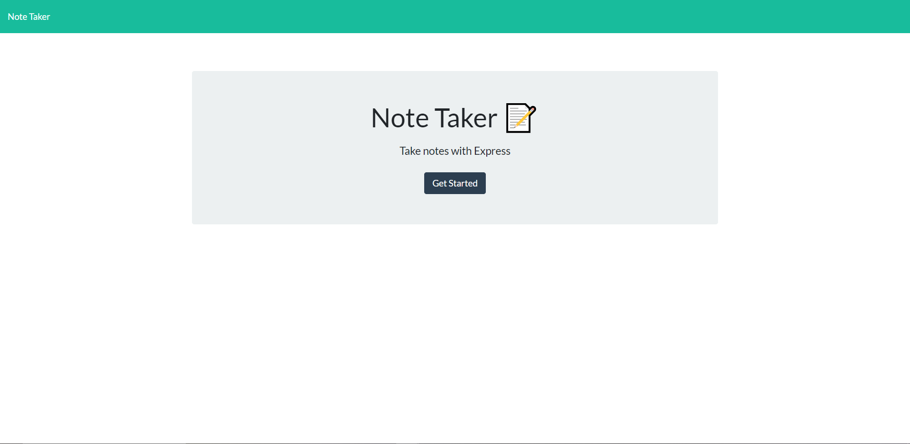

# Note Taker app

## Table of Contents
- [Description](#description)
- [Usage](#usage)
- [Questions](#questions)
- [Heroku](#heroku)
- [Screenshot](#screenshot)

## Description
This web app will allow a small business owner to create, save, view, and delete notes. The user will set a title to make the note easier to find and understand. This will also allow the user to keep track of daily tasks.

## Usage
```md
AS A small business owner
I WANT to be able to write and save notes
SO THAT I can organize my thoughts and keep track of tasks I need to complete
```

## Questions
Github: [codymichaud](https://github.com/codymichaud)
Email: cody.r.michaud@gmail.com

## Heroku

Deployed Heroku link --> https://glacial-meadow-69122.herokuapp.com/

## Screenshot

